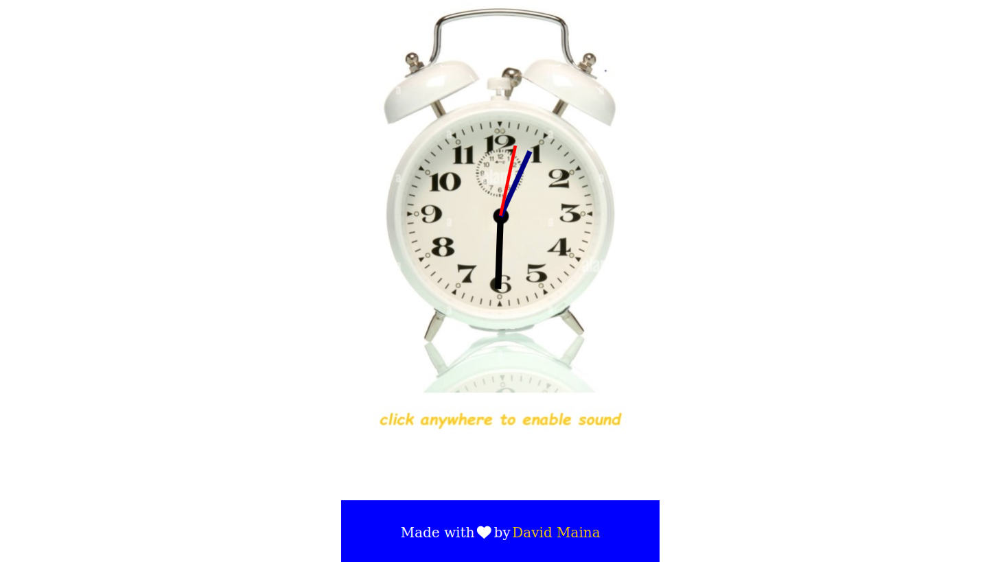

## JS Wall Clock

A simple wall clock built with HTML5, CSS, and JavaScript. It displays the current time with hour, minute, and second hands. It provides a visual representation of a traditional analog clock.

## Features

- Real-time updating of clock hands
- Smooth animations for smooth transitions
- Sound alert every second
- Synchronous with your current real-time

## Installation

1. Clone the repository: `git clone https://github.com/davymaish/wallclock.git`
2. Open the project directory.
3. Open the `index.html` file in a web browser.

## Contributing

Contributions are welcome! If you find any issues or have ideas for improvements, please open an issue or submit a pull request.

## License

This project is licensed under the [MIT License](LICENSE).

## Contact

For any inquiries or feedback, feel free to contact me via:

- Website: [davymaish.github.io](https://davymaish.github.io)
- Email: [davymaish6@gmail.com](mailto:davymaish6@gmail.com)
